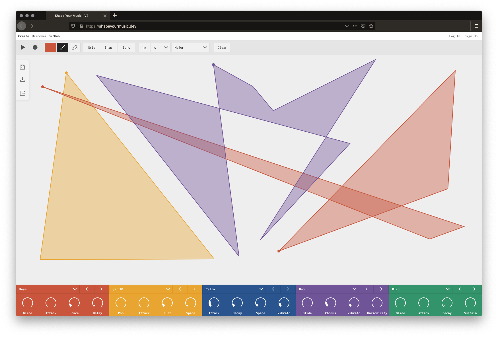
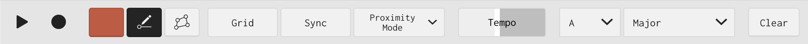

# Shape Your Music

_A geometric sequencer that suggests one answer to the question "What does a shape sound like?"._

[https://shapeyourmusic.dev/](https://shapeyourmusic.dev)

## About

Shape Your Music is a musical [geoboard](https://en.wikipedia.org/wiki/Geoboard) that explores a new way of composing and performing music using geometry.

It allows you to create melodic loops by drawing shapes. When a shape plays, a node traverses the perimeter of the shape at a constant speed, sounding a note at each vertex. Thus each edge represents a note. The first note of a shape is determined by the shape's `y` position on the plane. The note for each subsequent edge is determined by the angle between that edge and the previous edge. This angle determines the musical interval between the two notes(edges). For example: A sharp right turn means that the next note is much higher than the previous, while a shallow left turn means that the next note is a little lower. When the last point is reached, the loop starts again.

Using this app, one can:

- Draw multiple shapes to generate unique polyrhythms
- Manipulate shapes in real time to improvise and perform
- Experiment with different musical modes, keys, and tempos
- Use grid and syncing options to create defined rhythms and loops
- Move shapes up or down to transpose them within the scale, or side to side to move them in stereo space
- Change and adjust the sound that each color produces
- Record and export your project as either an audio file or as MIDI files
- Save projects and browse other people's creations

[Read more](https://ejarzo.github.io/#sym)

This is the third iteration of this project. I wrote the [original](https://github.com/ejarzo/sym_v2) in vanilla JS/jQuery 😬!

---

## 📖 User Manual

### Overview

Sound is created by drawing shapes on the canvas and clicking PLAY. There are two modes: DRAW and EDIT. While in DRAW mode, clicking on the canvas allows you to draw polygons by placing vertices. Each polygon represents a musical melody. In EDIT mode, you can adjust each polygon by dragging its vertices, or by dragging the entire polygon to a new position. Shapes higher up on the canvas start at higher notes than shapes lower down. Moving shapes left or right places them in stereo space (left/right on your speakers or headphones). Also in EDIT mode, you can click on a shape to display a context menu with more options.

Each shape is a certain color. The current color with which you are drawing is controlled with the color palette in the toolbar. A shape's color determines which instrument it uses to produce sound. The sounds for each color can be controlled with the colored panels at the bottom of the screen; if the red panel is set to the "Cello" instrument, every red shape will make a cello sound.

### Toolbar 

The toolbar allows you to adjust various aspects of your project.

#### Transport

| Name      | Description |
| --------- | ----------- |
| Play/Stop | Pressing play starts all shapes at their origin point. Shapes that are added during playback will start playing as soon as they are completed. |
| Record    | Pressing record allows you to download your project as an audio file (.wav). If playback is stopped when you click record, recording will begin when you begin playback. If the project is playing when you click record, the recording will start instantly. Pressing stop or record again will end the recording and show a window where you can listen and download the file that was generated. |

#### Drawing

| Name   | Description |
| ------ | ----------- |
| Color  | Select the color of the shapes you are drawing. Different colored shapes produce different sounds. |
| Draw   | Draw mode allows you to create shapes. Click to place vertices. Click on the origin point to complete a shape. Right click to cancel. |
| Edit   | Edit mode allows you to adjust your shapes. Drag vertices to edit the perimeter of your shape. Drag the whole shape to move it. Click on a shape to show more detailed options (see shape controls). |

#### Canvas

| Name         | Description |
| ------------ | ----------- |
| Grid         | When selected, the grid is shown |
| Snap To Grid | When selected, all points will snap to the grid when drawn, or when shapes are moved |
| Sync         | When selected, shapes will snap and lock to the same length - so that they will loop at the same time. Shapes can be “halved’ or “doubled” so that they loop half or twice as often. This allows for a defined rhythm. |
| Fullscreen   | Toggle Fullscreen |
| Clear        | Delete all shapes |

#### Music

| Name  | Description                     |
| ----- | ------------------------------- |
| Tempo | Change the speed of playback    |
| Key   | Select the root note            |
| Scale | Select the musical scale (mode) |

### Exporting

There are two ways to export your project: as audio or as MIDI.
1. **Audio**: Recording audio works like many DAWs. Click the record button to begin recording. Recording will begin when playback starts and captures the audio output of the project. Clicking record again or stopping playback will stop the current recording, which can then be downloaded as a `.wav` file from the Downloads section in the sidebar.
2. **MIDI**: Click `Export to MIDI` to download the project as a folder of MIDI files, one for each shape. Since the tempo is not synced to any real BPM, the melodies may sound slower or faster when loaded into another program, but all shapes will maintain their relative lengths.

### Shape Menu

The Shape menu allows you to control a shape's properties. CLICK on a shape to display this menu.

| Control        | Description                     |
| -------------- | ------------------------------- |
| Volume Slider  | The left side of the panel is a volume slider. Drag the white bar to adjust how loud the shape is  |
| Mute (toggle)  | When selected, the shape produces no sound |
| Solo (togggle) | When selected, the shape will be the only shape producing sound |
| Color          | Change the shape's color. This will change its sound to the corresponding instrument for that color |
| \*2            | Doubles the perimiter of the shape, making the loop last for twice as long |
| \2             | Halves the perimiter of the shape, making the loop last for half as long |
| Reverse        | Reverse the direction of playback. Reversing the direction will recalculate the notes based on the new angles - instead of simply playing the notes in opposite order |
| Delete Shape   | Deletes the shape from the canvas |

### Color Controller

The Color Controller allows you to change the sound generated by shapes of that color. Use the dropdown menu and arrow buttons to select the preset and the knobs to adjust the sound.

---

## 💻 Development

### Front End
The front end is a React app, created using [`create-react-app`](https://github.com/facebook/create-react-app).
It uses:
- [Tone.js](https://github.com/Tonejs/Tone.js) for music/audio generation
- [React Konva](https://github.com/konvajs/react-konva) for canvas manipulation
- [Teoria](https://github.com/saebekassebil/teoria) for music theory logic
- [Ant Design](https://ant.design/docs/react/introduce) for several UI components

To run: `yarn` and then `yarn start:app`.

### Backend
_NOTE: If you just want to play around with the client code, you can ignore this setup. Just use `yarn start:app`_

The backend consists of a a [FaunaDB database](https://fauna.com/) and serverless [Netlify functions](https://www.netlify.com/docs/functions/) to provide an API for viewing and saving projects. It uses [Netlify Identity](https://www.netlify.com/docs/identity/) to handle users, account creation and login. All functions live in the [functions](https://github.com/ejarzo/Shape-Your-Music/tree/master/functions) folder.

If you want to be able to save data locally, you wil need a [FaunaDB account](https://dashboard.fauna.com/accounts/register) (it's free). Once you have an account, you will need a server key that you will set in your local environment.

If everything is already setup, run with `yarn start:server`.

#### FaunaDB Setup
1. Create a fauna account
2. On the [dashboard](https://dashboard.fauna.com/), click `New Database`
3. Go to the `Security` tab
4. Click `Create New Key` with role: `Server`
5. Click `Save`
6. Copy your key
7. In your local environment (NOTE: this will NOT be your react app .env file. This will be your `~/.bash_profile`, `~/.zhrc`, etc.), set a new variable FAUNADB_SERVER_SECRET to be your copied key
8. Reload your terminal session and run `yarn start:server`. The first time this runs, it will create and boostrap your Fauna DB. If you reload your Fauna dashboard, you should see a new `projects` collection and `all_projects` index.

For more, see the [Netlify example repo](https://github.com/netlify/netlify-faunadb-example) which I used as a reference.

#### Netlify Setup
Netlify is used to handle user accounts through their [Identity](https://www.netlify.com/docs/identity/) feature. To fully integrate with the backend and be able to save your projects locally, you will need a Netlify account. Once you have an account, use their [CLI](https://www.netlify.com/docs/cli/) to login and initialize a project for this repo. Try signing up through the UI and you should get a confirmation email that redirects to your netlify project.

### To Test

Run `yarn test`.
